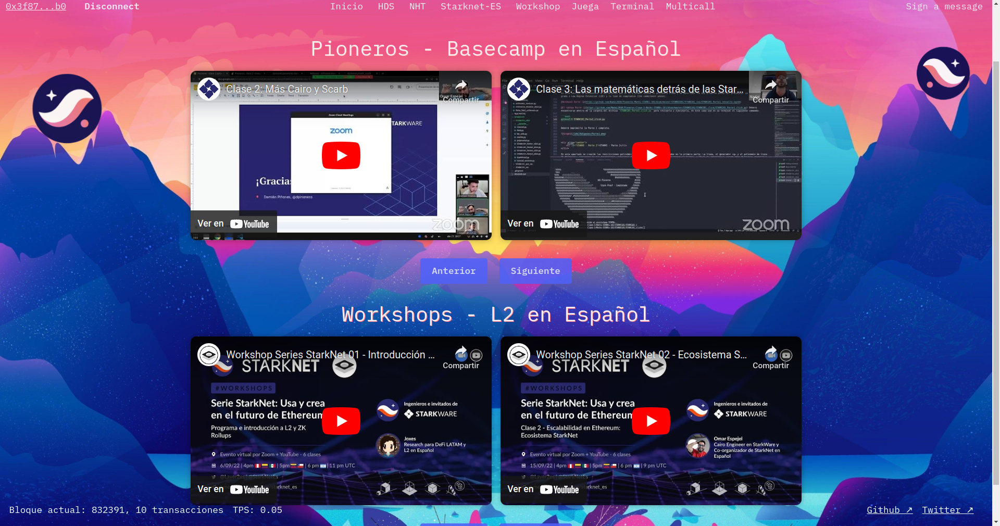
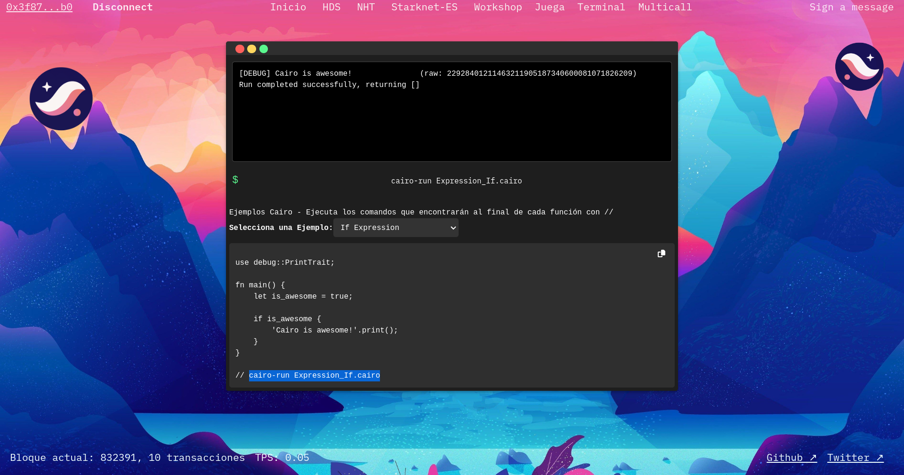
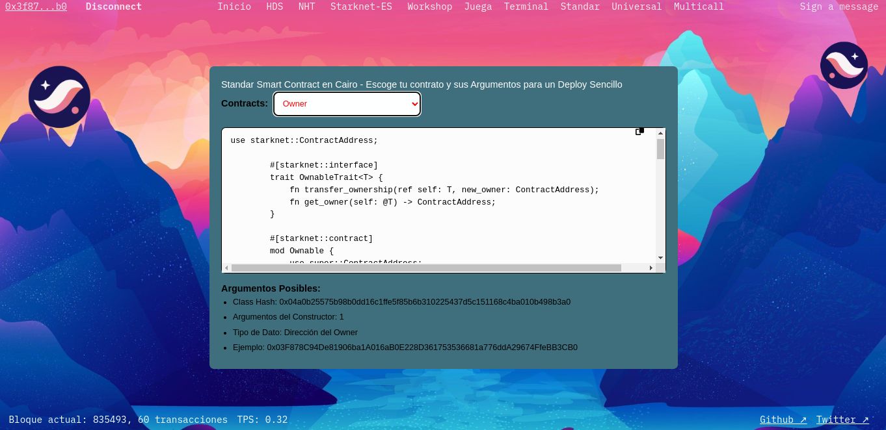
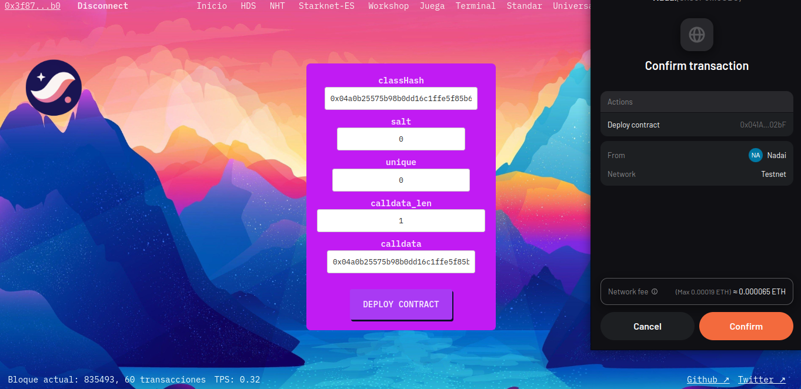
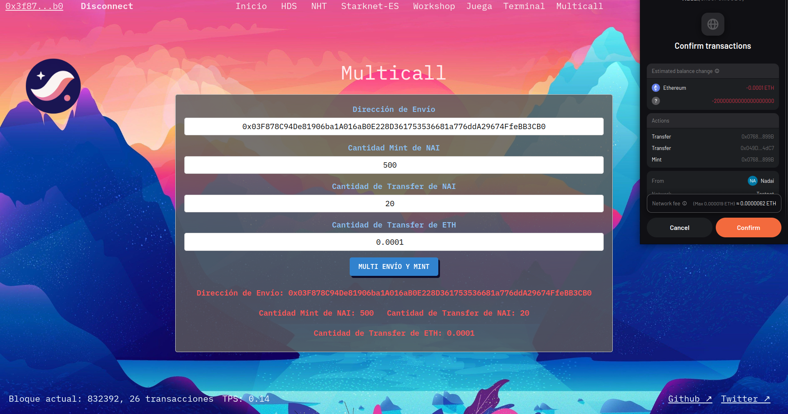
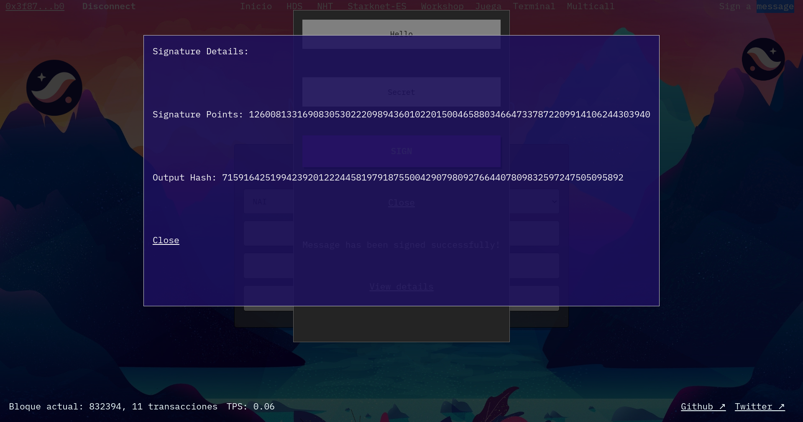

  <h1 style="font-size: larger;">
    
    <strong>Nadai's Cairo Learning dApp</strong> 
    
  </h1>

<a href="https://github.com/Starknet-Es">

</a>

<a href="https://github.com/Starknet-Es/StarknetEs-Aprendizaje">

# Summary
This is a test version of an application wich features serveral differents resources. The goal of this dApp is helping new developers to learn the Cairo programming language and onboarding them into Starknet in a fun and interactive way.

Nadai's Cairo Learning dApp is made out of the following sections:

## Home:
A form that detects the balance of the added tokens. A test token called `NAI` has been deployed on Cairo 1 (which allows free token minting), as well as tokens such as `ETH`, `DAI`, `WBTC`, or `USDT`. In the form, you need to enter the `Recipient`, `Amount`, and a secret word `Nadai` to unlock the `Send` button.

In this section, we aim to showcase the power of customizing ERC-20 token transfers. You can view the transaction data (`Calldata`) and see how it is executed in the explorer.

## HDS:
In this section we want to improve the experience of the community around the biweekly **"Hablando de Starknet"** Spanish-speaking show. Here we want to issue our POAPs under the form of NFTs on Starknet, where the secret word mentioned during the Space will unlock the corresponding button to mint the `NHT` token. The idea is to migrate the ERC-721 contracts from Cairo 0 to Cairo contracts, with each secret word hidden within the contract.

Therefore, in this section, you can learn about Starknet while being able to claim your `NHT` tokens with the secret word mentioned in the podcast. Furthermore, these `NHT` tokens will be displayed on `Braavos`, `Explorer` and more.

## NHT:
A design gallery for each HDS-related ERC-721 token, loading the metadata of each space. You can also send a token by providing the `From`, `Recipient`, and `Token ID` values, along with the secret word to unlock the "Nadai" button.

In this section, we reinforce what was seen in the token form. This time, we will see how the design is visualized in the transaction, the transaction data (`Calldata`), and how to easily transfer our POAP tokens.

## Starknet en Español:
This tab is dedicated to **"Jueves de Cairo"** which are **"Cairo-Thursdays"** organized by the Spanish-speaking community. We will also add official resources such as the Cairo Book, Starknet Book, Cairo Lang Docs, and Starknet Docs.

## Workshop:
This tab is dedicated to the "Basecamp de Pioneros," the first decentralized basecamp for the Spanish-speaking community powered by Starkware and led by some members of the community. You can also find a series of 7 workshops conducted by L2 en Español, featuring Omar Espejel and StarknetEs.

## Terminal:
This tab is designed for learning the Cairo syntax. The idea is to add the new syntax and have a simulation of the result printed in the terminal by running the appropriate command.

In this section, you can enhance learning with basic examples taken from Cairo-by-Example, Cairo-Book, Starknet-Book, or other libraries and resources. The goal is to read the code or contracts directly and test them without simulation, making it easier to learn the syntax through clear examples.

## Standar:
This tab is designed as a standard for contracts for easy development. Here, you can find information for each necessary data, as well as the logic of the contracts in case you need it for other developments. You will find the Class Hash of the declared contract and the number of arguments required for deployment. 

Additionally, you'll find an example of the arguments passed in each one. If you decide to deploy a standard contract, you can go directly to the next Universal section.

## Universal:
This tab is designed to display contracts with just one click, using Starknet's Universal Contract Deploy ([UDC](https://testnet.starkscan.co/contract/0x041a78e741e5af2fec34b695679bc6891742439f7afb8484ecd7766661ad02bf#write-contract)) making it easy, practical, and secure for all those who want to start testing in a simple way. You only need to decide what type of contract you need and adjust its values according to your requirements.

Additionally, we will provide the necessary steps to convert the values to felt252, along with an explanation and utility of each one.

## Multicall:
This tab will teach the power of native Multicall in Cairo. In this form, you can `Mint` the `NAI` token and transfer both `NAI` and `ETH` if desired, by executing 3 different calls, each with its own set of data (`Calldata`).

In this section, we can demonstrate how infinite approvals are no longer needed and how DeFi protocols in Starknet benefit from this power. The idea is to add various Multicall forms, including one for UDC, and provide an easy way for developers to deploy ERC-20, ERC-1155, AMM, Vault, or any other smart contract in Cairo that we want to include.

## Sign a message:
We are working on hash functions for message signing. In the "Sign a message" section, you can see how, when signing data like EIP-712, we can obtain a hash and an additional point derived from the private key. These can be useful in larger projects, such as multi-signature scheme verification, signing data for airdrops, emails, names, and other configurations, as well as verifying an account with its login. In this example, you should enter the message **`Hello`** followed by the secret word **`Secret`**, and proceed to sign. A message will appear indicating that the word and message are correct, and you can perform the signing with the data in your wallet (this is a test mode and is not fully implemented yet).

## Others:
We will also begin working on additional sections and learning ideas. It will display the current block of the Gorli network or the connected network, the transactions in that block provided by the provider, and a calculation showing the transactions per second (TPS) loaded in that block. It will also sometimes detect your Starknet ID.

