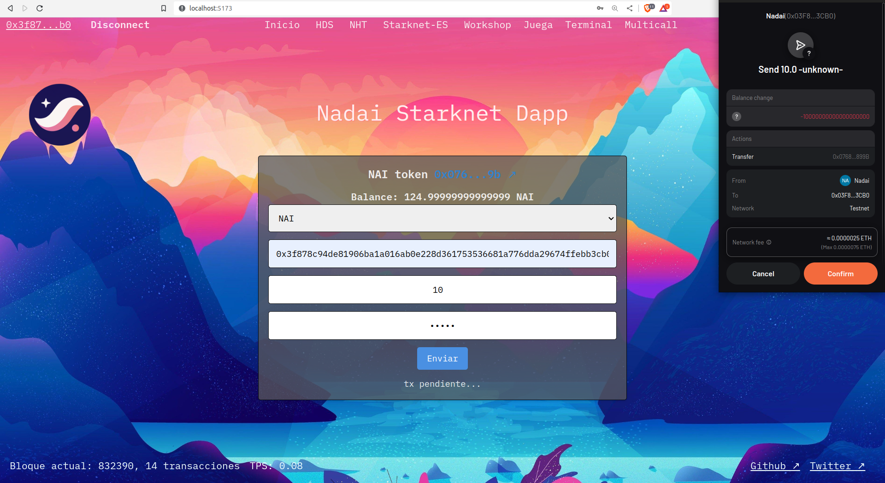
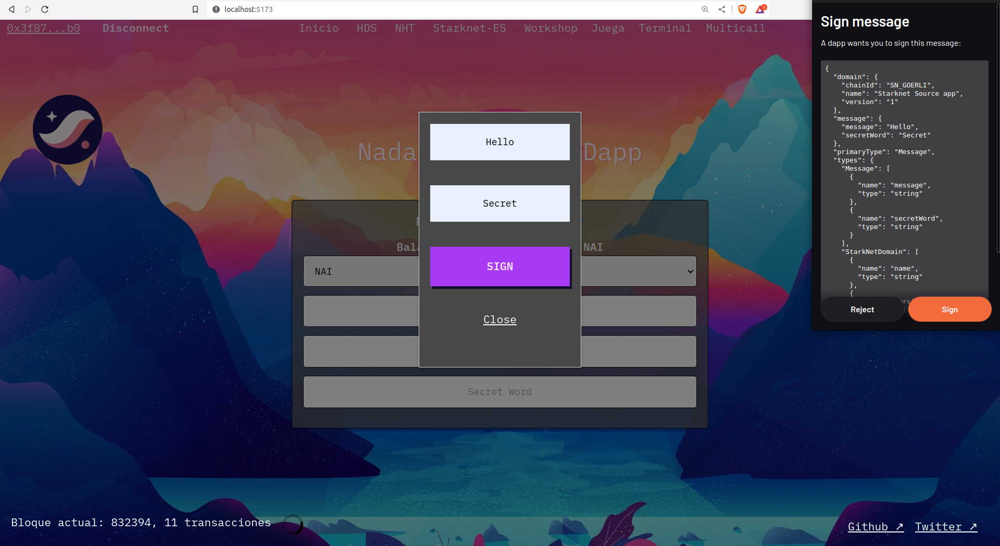

# Source Nadai Dapp
Esta aplicación es una versión de prueba en la que he estado aprendiendo a implementar varios recursos que puedan facilitar la entrada de nuevos desarrolladores al ecosistema.

En esta aplicación, encontrarás las siguientes secciones:

## Inicio: 
Un formulario que detecta el saldo de los tokens agregados. Se ha desplegado un token de prueba llamado `NAI` en Cairo 1 (que permite el mint libre de tokens), así como tokens de `ETH`, `DAI`, `WBTC` o `USDT`. En el formulario, debes agregar el `Receipent`, la `Amount` y una palabra secreta `Nadai` para desbloquear el botón `Enviar`

En esta sección, intentamos mostrar el poder de personalizar envíos de tokens ERC-20. Podemos ver los datos de la transacción (`Calldata`) y mostrar cómo se ejecuta en el explorador.

## HDS:
Un espacio que simula la experiencia vivida en HDS (Hablando de Starknet), donde cada invitado comparte su conocimiento sobre temas específicos del ecosistema. Estamos migrando este espacio con POAP aquí, donde cada palabra secreta desbloqueará el botón correspondiente para crear cada token `NHT`. La idea es migrar los contratos de ERC-721 de Cairo 0 a contratos Cairo y que cada palabra pueda estar oculta en el propio contrato.

En esta sección, podemos aprender sobre el ecosistema con invitados de habla hispana. Podemos reclamar nuestros `NHT` con la palabra secreta del espacio, y estos `NHT` se pueden visualizar en `Braavos`, `Exploradores`...

## NHT:
Una galería de los diseños de cada token ERC-721 lanzado, cargando los metadatos de cada uno de los espacios. También se puede enviar un token indicando los valores de `From`, `Recipient` y `Token ID`, además de la palabra secreta para desbloquear el botón "Nadai".

En esta sección, reforzaremos lo visto en el formulario de tokens. Esta vez veremos cómo se visualiza el diseño en la transacción, los datos de la transacción (`Calldata`) y cómo mover nuestros POAP de una manera sencilla.

## Starknet en Español:
Esta pestaña está dedicada a los Jueves de Cairo, que realizamos para la comunidad de habla hispana. También se añadirán recursos oficiales como Cairo Book, Starknet Book, Cairo Lang Docs, Starknet Docs...

## Workshop:
Esta pestaña está dedicada al Basecamp de Pioneros, el primer basecamp descentralizado de habla hispana impulsado por Starkware y llevado a cabo por algunos miembros de la comunidad. También puedes encontrar una serie de 7 talleres impartidos por L2 en Español, con Omar Espejel y StarknetEs.

## Terminal:
Esta pestaña está diseñada para aprender la sintaxis de Cairo. La idea es ir agregando la nueva sintaxis y tener una simulación del resultado impresa en la Terminal, ejecutando el comando correspondiente.

En esta sección, se puede potenciar el aprendizaje con ejemplos básicos que se pueden extraer de Cairo-by-Example, Cairo-Book, Starknet-Book u otras bibliotecas y recursos. La idea es poder leer directamente el código o los contratos y probarlos sin simulación, lo que facilitaría el aprendizaje de la sintaxis mediante ejemplos claros.

## Multicall:
Esta pestaña servirá para aprender el poder de Multicall nativo en Cairo. En este formulario, se puede "Mintear" el token "NAI" y transferir tanto "NAI" como "ETH" si así se desea, ejecutando 3 llamadas diferentes, cada una con su propio conjunto de datos (`Calldata`).

En esta sección, podemos enseñar cómo ya no se necesitan aprobaciones infinitas y cómo los protocolos DeFi en Starknet se benefician de este poder. La idea es agregar varios formularios de Multicall, incluido uno para UDC, y utilizar los parámetros necesarios para cada despliegue, brindando una forma sencilla para que los desarrolladores desplieguen ERC-20, ERC-1155, AMM, Vault o cualquier otro contrato inteligente en Cairo que deseemos agregar.

## Sign a message
Estamos trabajando en funciones hash para firmar mensajes. En la sección `"Sign un mensaje"`, puedes ver cómo al firmar datos como EIP-712, podemos obtener un hash y un punto adicional derivados de la clave privada. Estos pueden ser útiles en proyectos más grandes, como verificación de esquemas multifirma, firma de datos para airdrops, correos, nombres, y otras configuraciones, así como para verificar una cuenta con su inicio de sesión. En este ejemplo, debes agregar el mensaje `Hello`, luego la palabra secreta `Secret` y proceder a hacer la firma. Aparecerá un mensaje indicando que la palabra y el mensaje son correctos, y podrás realizar la firma con los datos en tu Wallet (es solo una prueba, aún no está completamente implementado).

## Otros
También comenzaremos a trabajar en secciones adicionales e ideas de aprendizaje. Se mostrará el bloque actual de la red Gorli o de la red a la que estés conectado, las transacciones de ese bloque proporcionadas por el proveedor, y un cálculo que muestra las transacciones por segundo (TPS) que se han cargado en ese bloque. También se detectará `a veces` el ID de Starknet que tengas.